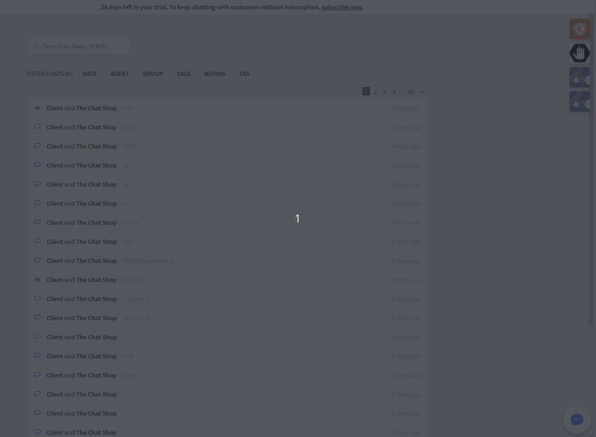

## Livechat Agent App Widget Offline Bug

In order to reproduce the bug:

1) Add this app on your widgets and start navigating on the archives.

2) Make sure the app properly displays each ChatId and CustomerId when changing archives.

3) Open developer tools(F12) -> go to Network tab -> check Offline

4) Uncheck Offline and start changing archives again

5) The app should stop working, not getting any new updates and the icon of the app should now be with low opacity

6) In order for the app to work again one must press the Icon to force the app to reload.

#Gif demonstating the bug in real time

